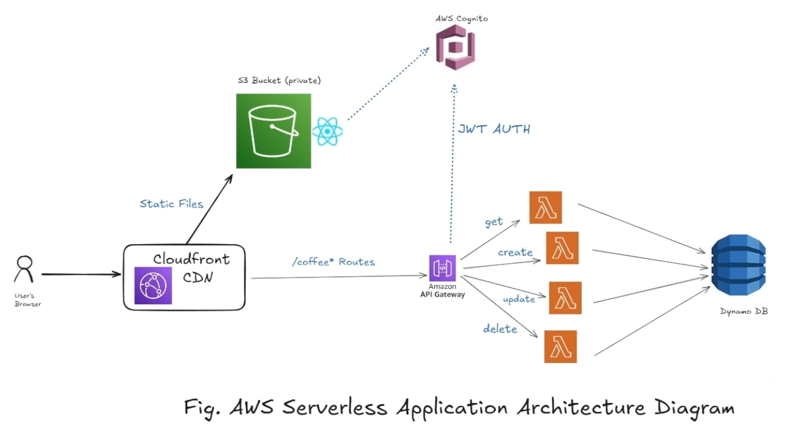

# Building Fullstack Serverless Apps On AWS

Learn how to build and deploy a real-world serverless CRUD app using AWS Lambda, DynamoDB, Cognito, API Gateway & CDN.

This project is carried out in my local environment using the localStack tool, and I am sharing this repository with you for those who want to get started quickly and not waste time, mainly in the resource definition commands in the “init.sh” file that I used to initialize localstack resources and avoid reconfiguring and creating resources each time the localstack container is restarted. I hope this helps you give your best.

link: https://www.udemy.com/course/aws-serverless-course

